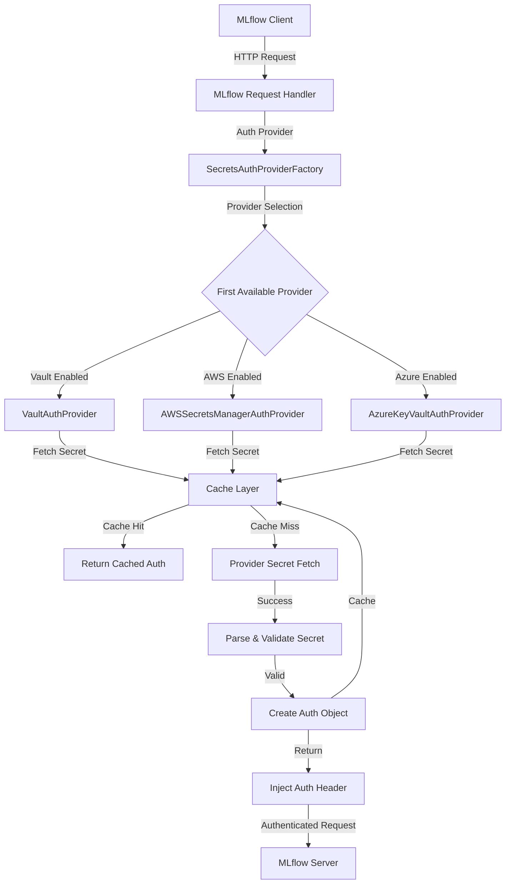
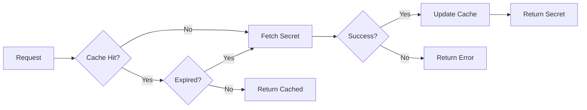

# Architecture

MLflow Secrets Auth implements a clean, extensible architecture that seamlessly integrates with MLflow's authentication system while maintaining security and performance best practices.

## Overview

The plugin uses a factory pattern with provider-specific implementations to retrieve credentials from various secret management systems. The architecture emphasizes security, caching, and extensibility while maintaining compatibility with MLflow's existing authentication framework.

## High-Level Architecture



## Core Components

### SecretsAuthProviderFactory

The main factory class that implements MLflow's `RequestAuthProvider` interface and manages provider selection.

**Responsibilities**:
- Provider discovery and instantiation
- Request routing to active provider
- Fallback behavior when no provider is available
- Integration with MLflow's authentication lifecycle

**Key Methods**:
- `get_request_auth(url)` - Main entry point for authentication
- `_get_actual_provider()` - Lazy provider instantiation
- `_is_enabled()` - Provider availability check

### SecretsBackedAuthProvider (Base Class)

Abstract base class that defines the common interface and shared functionality for all provider implementations.

**Core Features**:
- Caching with configurable TTL
- Retry logic with exponential backoff and jitter
- Host allowlisting validation
- Credential parsing and validation
- Error handling and logging

**Abstract Methods**:
```python
def _fetch_secret(self) -> str | None
def _get_cache_key(self) -> str
def _get_auth_mode(self) -> str
def _get_ttl(self) -> int
```

### Provider Implementations

#### VaultAuthProvider
- **Authentication**: Token or AppRole
- **Secret Formats**: KV v1 and KV v2 support
- **Features**: Auto-detection of KV version, graceful fallback

#### AWSSecretsManagerAuthProvider  
- **Authentication**: IAM credentials, roles, profiles
- **Secret Formats**: SecretString and SecretBinary
- **Features**: Multi-region support, version handling

#### AzureKeyVaultAuthProvider
- **Authentication**: DefaultAzureCredential chain
- **Secret Formats**: Key Vault secrets
- **Features**: Managed identity support, certificate auth

## Secret Resolution Flow

### 1. Request Interception

```python
# MLflow makes HTTP request
response = requests.get(
    "https://mlflow.company.com/api/2.0/mlflow/experiments/list",
    auth=auth_provider.get_request_auth(url)
)
```

### 2. Provider Selection

```python
def _get_actual_provider(self) -> SecretsBackedAuthProvider | None:
    """Select first available provider from priority list."""
    for name, provider_cls in self._PROVIDERS.items():
        if is_provider_enabled(name):
            try:
                return provider_cls()
            except Exception:
                continue  # Try next provider
    return None
```

### 3. Host Validation

```python
def _is_host_allowed(self, hostname: str) -> bool:
    """Validate hostname against allowlist patterns."""
    allowed_hosts = get_allowed_hosts()
    if not allowed_hosts:
        return True
    
    return any(
        fnmatch.fnmatch(hostname, pattern)
        for pattern in allowed_hosts
    )
```

### 4. Cache Check

```python
def _fetch_secret_cached(self) -> dict[str, str] | None:
    """Check cache first, fetch if needed."""
    cache_key = self._get_cache_key()
    cached = self._cache.get(cache_key)
    
    if cached and not cached.is_expired():
        return cached.data
    
    # Cache miss - fetch from provider
    secret = self._fetch_secret()
    if secret:
        self._cache.set(cache_key, secret, self._get_ttl())
    
    return secret
```

### 5. Secret Fetching

Provider-specific implementation retrieves secret from the configured source:

```python
# Vault example
def _fetch_secret(self) -> str | None:
    client = self._get_vault_client()
    response = client.secrets.kv.v2.read_secret_version(path=secret_path)
    return json.dumps(response["data"]["data"])
```

### 6. Authentication Object Creation

```python
def _create_auth(self, secret_data: dict[str, str]) -> requests.auth.AuthBase:
    """Create appropriate auth object based on mode."""
    auth_mode = self._get_auth_mode()
    
    if auth_mode == "bearer":
        token = secret_data.get("token")
        return BearerAuth(token)
    elif auth_mode == "basic":
        username = secret_data.get("username")
        password = secret_data.get("password")
        return HTTPBasicAuth(username, password)
```

## Caching Architecture

### Cache Implementation

The caching layer provides in-memory storage with TTL expiration and automatic cache busting.

**Features**:
- Per-configuration caching (different configs = different cache entries)
- Configurable TTL per provider
- Automatic expiration based on timestamps
- Cache busting on authentication failures (401/403)
- Thread-safe operations

### Cache Key Generation

Cache keys are generated based on provider-specific configuration to ensure proper isolation:

```python
# Vault example
def _get_cache_key(self) -> str:
    vault_addr = get_env_var("VAULT_ADDR", "")
    secret_path = get_env_var("MLFLOW_VAULT_SECRET_PATH", "")
    return f"{vault_addr}:{secret_path}"
```

### Cache Lifecycle



## Error Handling and Resilience

### Retry Logic

The plugin implements sophisticated retry logic with exponential backoff and jitter:

```python
def retry_with_jitter(func, max_retries=3, base_delay=1.0, max_delay=30.0):
    """Execute function with exponential backoff and jitter."""
    for attempt in range(max_retries + 1):
        try:
            return func()
        except Exception as e:
            if attempt == max_retries:
                raise e
            
            # Exponential backoff with jitter
            delay = min(base_delay * (2 ** attempt), max_delay)
            jitter = random.uniform(0, delay * 0.1)
            time.sleep(delay + jitter)
```

### Failure Modes

The architecture handles various failure scenarios gracefully:

1. **Provider Unavailable**: Factory selects next available provider
2. **Network Failures**: Retry with exponential backoff
3. **Authentication Failures**: Cache busting and re-authentication
4. **Configuration Errors**: Detailed error messages and fallback behavior
5. **Secret Not Found**: Graceful degradation with logging

### Circuit Breaker Pattern

For production resilience, the plugin implements circuit breaker behavior:

```python
class ProviderCircuitBreaker:
    def __init__(self, failure_threshold=5, timeout=60):
        self.failure_count = 0
        self.failure_threshold = failure_threshold
        self.timeout = timeout
        self.last_failure_time = None
        self.state = "CLOSED"  # CLOSED, OPEN, HALF_OPEN
```

## Security Architecture

### Host Allowlisting

Host validation prevents credential leakage to unauthorized servers:

```python
def validate_host(self, url: str) -> bool:
    """Validate URL host against allowlist."""
    parsed = urlparse(url)
    hostname = parsed.hostname
    
    if not hostname:
        return False
    
    allowed_hosts = get_allowed_hosts()
    if not allowed_hosts:
        return True  # No restrictions if not configured
    
    return any(
        fnmatch.fnmatch(hostname, pattern)
        for pattern in allowed_hosts
    )
```

### Credential Redaction

All logging output automatically redacts sensitive information:

```python
def redact_sensitive_data(text: str) -> str:
    """Redact common credential patterns from text."""
    patterns = [
        r"(Bearer\s+)([A-Za-z0-9._\-]+)",
        r"(Basic\s+)([A-Za-z0-9+/=]+)",
        r'("(?:token|password|secret|key)"\s*:\s*")([^"]+)(")',
    ]
    
    for pattern in patterns:
        text = re.sub(pattern, lambda m: f"{m.group(1)}{mask_secret(m.group(2))}{m.group(3) if len(m.groups()) > 2 else ''}", text)
    
    return text
```

### Memory Security

- No persistence of credentials to disk
- Secure memory handling for sensitive data
- Automatic cleanup of expired cache entries
- Zero-copy operations where possible

## Extensibility

### Adding New Providers

The architecture supports easy addition of new secret management providers:

```python
class CustomProvider(SecretsBackedAuthProvider):
    def __init__(self):
        super().__init__("custom", default_ttl=300)
    
    def _fetch_secret(self) -> str | None:
        # Implement custom secret fetching logic
        pass
    
    def _get_cache_key(self) -> str:
        # Generate provider-specific cache key
        pass
    
    def _get_auth_mode(self) -> str:
        # Return "bearer" or "basic"
        pass
    
    def _get_ttl(self) -> int:
        # Return cache TTL in seconds
        pass
```

### Configuration System

The configuration system uses environment variables for consistency and container-friendliness:

```python
# Provider enablement
def is_provider_enabled(provider_name: str) -> bool:
    # Check global list
    global_enable = get_env_var("MLFLOW_SECRETS_AUTH_ENABLE", "")
    if provider_name.lower() in global_enable.lower().split(","):
        return True
    
    # Check provider-specific flag
    env_key = f"MLFLOW_SECRETS_AUTH_ENABLE_{provider_name.upper().replace('-', '_')}"
    return get_env_bool(env_key, False)
```

## Performance Considerations

### Lazy Initialization

Providers are instantiated only when needed:

```python
def _get_actual_provider(self) -> SecretsBackedAuthProvider | None:
    if self._actual_provider is not None:
        return self._actual_provider
    
    # Lazy instantiation
    for name, provider_cls in self._PROVIDERS.items():
        if is_provider_enabled(name):
            try:
                self._actual_provider = provider_cls()
                return self._actual_provider
            except Exception:
                continue
    return None
```

### Connection Pooling

Provider implementations reuse connections when possible:

```python
class VaultAuthProvider:
    def __init__(self):
        self._vault_client = None  # Cached client instance
    
    def _get_vault_client(self):
        if self._vault_client is not None:
            return self._vault_client
        
        # Create and cache client
        self._vault_client = hvac.Client(url=vault_addr)
        return self._vault_client
```

### Async Considerations

While the current implementation is synchronous, the architecture supports future async operations:

```python
# Future async support
async def _fetch_secret_async(self) -> str | None:
    async with self._get_async_client() as client:
        response = await client.get_secret(self.secret_path)
        return response.value
```

## Integration Points

### MLflow Integration

The plugin integrates seamlessly with MLflow's authentication system:

```python
# Entry point registration in pyproject.toml
[tool.poetry.plugins."mlflow.request_auth_provider"]
mlflow_secrets_auth = "mlflow_secrets_auth:SecretsAuthProviderFactory"
```

### Monitoring Integration

The architecture supports monitoring and observability:

```python
# Metrics collection
class MetricsCollector:
    def record_cache_hit(self, provider: str):
        self.cache_hits[provider] += 1
    
    def record_secret_fetch_duration(self, provider: str, duration: float):
        self.fetch_durations[provider].append(duration)
```

## Next Steps

- **[Security Concepts](security.md)** - Detailed security model and threat analysis
- **[Caching and Retries](caching-and-retries.md)** - Deep dive into caching and retry mechanisms
- **[Provider Documentation](../providers/)** - Provider-specific implementation details
- **[Configuration Reference](../configuration.md)** - Complete configuration options
