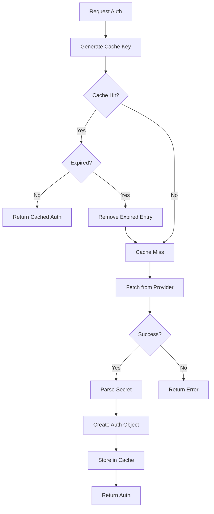

# Caching and Retries

MLflow Secrets Auth implements sophisticated caching and retry mechanisms to optimize performance, ensure reliability, and handle transient failures gracefully.

## Caching Architecture

### Overview

The caching system provides in-memory storage of retrieved credentials with configurable TTL (Time To Live) expiration. Caching reduces latency, minimizes load on secret management systems, and improves user experience.

### Cache Implementation

#### Cache Structure

```python
class CacheEntry:
    """Represents a cached secret with expiration."""
    
    def __init__(self, data: dict[str, str], ttl: int):
        self.data = data
        self.created_at = time.time()
        self.expiry = self.created_at + ttl
    
    def is_expired(self) -> bool:
        """Check if cache entry has expired."""
        return time.time() > self.expiry
    
    def remaining_ttl(self) -> int:
        """Calculate remaining TTL in seconds."""
        return max(0, int(self.expiry - time.time()))


class SecretCache:
    """Thread-safe in-memory cache for secrets."""
    
    def __init__(self):
        self._cache: dict[str, CacheEntry] = {}
        self._lock = threading.RLock()
    
    def get(self, key: str) -> dict[str, str] | None:
        """Retrieve cached secret if not expired."""
        with self._lock:
            entry = self._cache.get(key)
            if entry and not entry.is_expired():
                return entry.data
            elif entry:
                # Clean up expired entry
                del self._cache[key]
            return None
    
    def set(self, key: str, data: dict[str, str], ttl: int) -> None:
        """Store secret in cache with TTL."""
        with self._lock:
            self._cache[key] = CacheEntry(data, ttl)
    
    def delete(self, key: str) -> None:
        """Remove specific cache entry."""
        with self._lock:
            self._cache.pop(key, None)
    
    def clear(self) -> None:
        """Clear all cache entries."""
        with self._lock:
            self._cache.clear()
```

#### Cache Key Generation

Cache keys are generated based on provider-specific configuration to ensure proper isolation:

```python
# Vault provider cache key
def _get_cache_key(self) -> str:
    vault_addr = get_env_var("VAULT_ADDR", "")
    secret_path = get_env_var("MLFLOW_VAULT_SECRET_PATH", "")
    return f"vault:{vault_addr}:{secret_path}"

# AWS provider cache key  
def _get_cache_key(self) -> str:
    region = get_env_var("AWS_REGION", "")
    secret_name = get_env_var("MLFLOW_AWS_SECRET_NAME", "")
    return f"aws:{region}:{secret_name}"

# Azure provider cache key
def _get_cache_key(self) -> str:
    vault_url = get_env_var("MLFLOW_AZURE_KEY_VAULT_URL", "")
    secret_name = get_env_var("MLFLOW_AZURE_SECRET_NAME", "")
    return f"azure:{vault_url}:{secret_name}"
```

### Cache Lifecycle

#### Cache Hit Flow



#### Cache Operations

```python
def _fetch_secret_cached(self) -> dict[str, str] | None:
    """Fetch secret with caching support."""
    cache_key = self._get_cache_key()
    
    # Check cache first
    cached_secret = self._cache.get(cache_key)
    if cached_secret is not None:
        self.logger.debug("Cache hit for key: %s", cache_key)
        return cached_secret
    
    # Cache miss - fetch from provider
    self.logger.debug("Cache miss for key: %s", cache_key)
    secret_json = self._fetch_secret()
    
    if secret_json:
        try:
            secret_data = json.loads(secret_json)
            # Store in cache with configured TTL
            self._cache.set(cache_key, secret_data, self._get_ttl())
            return secret_data
        except json.JSONDecodeError as e:
            self.logger.error("Failed to parse secret JSON: %s", e)
    
    return None
```

### TTL Configuration

#### Per-Provider TTL Settings

Each provider supports independent TTL configuration:

```bash
# Vault TTL (default: 300 seconds)
MLFLOW_VAULT_TTL_SEC=300

# AWS TTL (default: 300 seconds)  
MLFLOW_AWS_TTL_SEC=600

# Azure TTL (default: 300 seconds)
MLFLOW_AZURE_TTL_SEC=900
```

#### TTL Validation

TTL values are validated and clamped to reasonable ranges:

```python
def validate_ttl(ttl: int, min_ttl: int = 60, max_ttl: int = 3600) -> int:
    """Validate and clamp TTL to reasonable bounds."""
    if ttl < min_ttl:
        logger.warning(f"TTL {ttl} too low, using minimum {min_ttl}")
        return min_ttl
    if ttl > max_ttl:
        logger.warning(f"TTL {ttl} too high, using maximum {max_ttl}")
        return max_ttl
    return ttl
```

#### Environment-Specific TTL Recommendations

```bash
# Development: Short TTL for rapid iteration
MLFLOW_VAULT_TTL_SEC=60      # 1 minute

# Staging: Medium TTL for testing
MLFLOW_VAULT_TTL_SEC=300     # 5 minutes

# Production: Longer TTL for performance
MLFLOW_VAULT_TTL_SEC=900     # 15 minutes

# High-security: Very short TTL
MLFLOW_VAULT_TTL_SEC=30      # 30 seconds
```

### Cache Busting

#### Automatic Cache Busting

The cache automatically invalidates entries on authentication failures:

```python
def _handle_auth_failure(self, response: requests.Response, url: str) -> None:
    """Handle authentication failure by clearing cache."""
    if response.status_code in (401, 403):
        cache_key = self._get_cache_key()
        self._cache.delete(cache_key)
        
        self.logger.info(
            "Cleared cache due to auth failure",
            extra={
                "status_code": response.status_code,
                "url": redact_sensitive_data(url),
                "cache_key": cache_key
            }
        )
```

#### Manual Cache Operations

Future CLI support for manual cache management:

```bash
# Clear all cached secrets
mlflow-secrets-auth cache clear

# Clear specific provider cache
mlflow-secrets-auth cache clear --provider vault

# Show cache status
mlflow-secrets-auth cache status
```

### Cache Security

#### Memory-Only Storage

- **No Disk Persistence**: Cache exists only in memory
- **Process Isolation**: Cache cleared on process termination
- **Secure Cleanup**: Automatic cleanup of expired entries

#### Cache Isolation

```python
# Different configurations use different cache keys
# Production Vault
cache_key_prod = "vault:https://vault.prod.com:secret/mlflow/prod"

# Staging Vault  
cache_key_staging = "vault:https://vault.staging.com:secret/mlflow/staging"

# These are isolated in separate cache entries
```

#### Thread Safety

```python
class ThreadSafeCache:
    """Thread-safe cache implementation."""
    
    def __init__(self):
        self._cache = {}
        self._lock = threading.RLock()  # Reentrant lock
    
    def get(self, key: str):
        with self._lock:
            return self._cache.get(key)
    
    def set(self, key: str, value, ttl: int):
        with self._lock:
            self._cache[key] = CacheEntry(value, ttl)
```

## Retry Mechanisms

### Retry Strategy

The plugin implements exponential backoff with jitter to handle transient failures gracefully.

#### Retry Implementation

```python
def retry_with_jitter(
    func: Callable[[], T], 
    max_retries: int = 3,
    base_delay: float = 1.0,
    max_delay: float = 30.0,
    backoff_factor: float = 2.0,
    jitter_factor: float = 0.1
) -> T:
    """Execute function with exponential backoff and jitter."""
    
    for attempt in range(max_retries + 1):
        try:
            return func()
        except Exception as e:
            if attempt == max_retries:
                # Final attempt failed
                raise e
            
            # Calculate delay with exponential backoff
            delay = min(base_delay * (backoff_factor ** attempt), max_delay)
            
            # Add jitter to prevent thundering herd
            jitter = random.uniform(0, delay * jitter_factor)
            total_delay = delay + jitter
            
            logger.debug(
                f"Attempt {attempt + 1} failed, retrying in {total_delay:.2f}s",
                extra={"error": str(e), "attempt": attempt + 1}
            )
            
            time.sleep(total_delay)
    
    raise RuntimeError("Retry logic error")  # Should never reach here
```

#### Retry Configuration

```python
# Default retry settings
DEFAULT_RETRY_CONFIG = {
    "max_retries": 3,
    "base_delay": 1.0,      # 1 second
    "max_delay": 30.0,      # 30 seconds maximum
    "backoff_factor": 2.0,  # Double delay each attempt
    "jitter_factor": 0.1    # 10% jitter
}

# Environment variable overrides
def get_retry_config() -> dict:
    return {
        "max_retries": get_env_int("MLFLOW_SECRETS_MAX_RETRIES", 3),
        "base_delay": get_env_float("MLFLOW_SECRETS_BASE_DELAY", 1.0),
        "max_delay": get_env_float("MLFLOW_SECRETS_MAX_DELAY", 30.0),
    }
```

#### Retry Examples

**Timing Examples**:
```
Attempt 1: Immediate
Attempt 2: 1.0s + jitter (0.0-0.1s) = ~1.05s
Attempt 3: 2.0s + jitter (0.0-0.2s) = ~2.15s  
Attempt 4: 4.0s + jitter (0.0-0.4s) = ~4.25s
```

### Retryable Conditions

#### Network Errors

```python
RETRYABLE_EXCEPTIONS = (
    requests.exceptions.ConnectionError,
    requests.exceptions.Timeout,
    requests.exceptions.HTTPError,  # 5xx only
    socket.timeout,
    socket.gaierror,
)

def is_retryable_error(exception: Exception) -> bool:
    """Determine if error is worth retrying."""
    if isinstance(exception, requests.exceptions.HTTPError):
        # Only retry server errors (5xx), not client errors (4xx)
        return 500 <= exception.response.status_code < 600
    
    return isinstance(exception, RETRYABLE_EXCEPTIONS)
```

#### Provider-Specific Retry Logic

**Vault Retries**:
```python
def _fetch_secret(self) -> str | None:
    """Fetch secret with Vault-specific retry logic."""
    
    def _vault_fetch():
        client = self._get_vault_client()
        if not client or not client.is_authenticated():
            raise VaultAuthenticationError("Vault not authenticated")
        
        # Try KV v2 first, then v1
        try:
            response = client.secrets.kv.v2.read_secret_version(path=path)
            return json.dumps(response["data"]["data"])
        except hvac.exceptions.InvalidPath:
            # Fallback to KV v1
            response = client.secrets.kv.v1.read_secret(path=path)
            return json.dumps(response["data"])
    
    return retry_with_jitter(_vault_fetch)
```

**AWS Retries**:
```python
def _fetch_secret(self) -> str | None:
    """Fetch secret with AWS-specific retry logic."""
    
    def _aws_fetch():
        client = self._get_secrets_client()
        response = client.get_secret_value(SecretId=self.secret_name)
        
        # Handle both SecretString and SecretBinary
        if 'SecretString' in response:
            return response['SecretString']
        else:
            # Convert binary to base64 string
            import base64
            binary_data = response['SecretBinary']
            return base64.b64encode(binary_data).decode('utf-8')
    
    return retry_with_jitter(_aws_fetch)
```

### Circuit Breaker Pattern

For production resilience, implement circuit breaker pattern:

```python
class CircuitBreaker:
    """Circuit breaker for provider calls."""
    
    def __init__(self, failure_threshold: int = 5, timeout: int = 60):
        self.failure_threshold = failure_threshold
        self.timeout = timeout
        self.failure_count = 0
        self.last_failure_time = None
        self.state = "CLOSED"  # CLOSED, OPEN, HALF_OPEN
    
    def call(self, func: Callable) -> Any:
        """Execute function with circuit breaker protection."""
        if self.state == "OPEN":
            if time.time() - self.last_failure_time < self.timeout:
                raise CircuitBreakerOpenError("Circuit breaker is open")
            else:
                self.state = "HALF_OPEN"
        
        try:
            result = func()
            # Success resets the circuit breaker
            if self.state == "HALF_OPEN":
                self.state = "CLOSED"
                self.failure_count = 0
            return result
            
        except Exception as e:
            self.failure_count += 1
            self.last_failure_time = time.time()
            
            if self.failure_count >= self.failure_threshold:
                self.state = "OPEN"
            
            raise e
```

## Performance Optimization

### Cache Hit Optimization

#### Metrics Collection

```python
class CacheMetrics:
    """Collect cache performance metrics."""
    
    def __init__(self):
        self.hits = 0
        self.misses = 0
        self.total_requests = 0
    
    def record_hit(self):
        self.hits += 1
        self.total_requests += 1
    
    def record_miss(self):
        self.misses += 1
        self.total_requests += 1
    
    def hit_rate(self) -> float:
        if self.total_requests == 0:
            return 0.0
        return self.hits / self.total_requests
    
    def stats(self) -> dict:
        return {
            "hits": self.hits,
            "misses": self.misses,
            "total_requests": self.total_requests,
            "hit_rate": self.hit_rate()
        }
```

#### Cache Warming

For high-performance scenarios, implement cache warming:

```python
def warm_cache(self) -> None:
    """Pre-populate cache with secrets."""
    try:
        # Fetch secret to populate cache
        self._fetch_secret_cached()
        logger.info("Cache warmed successfully")
    except Exception as e:
        logger.warning(f"Cache warming failed: {e}")
```

### Connection Pooling

#### Provider Connection Reuse

```python
class VaultAuthProvider:
    """Vault provider with connection pooling."""
    
    def __init__(self):
        super().__init__("vault", default_ttl=300)
        self._vault_client = None
        self._client_lock = threading.Lock()
    
    def _get_vault_client(self):
        """Get or create Vault client with connection reuse."""
        if self._vault_client is not None:
            # Verify client is still authenticated
            try:
                if self._vault_client.is_authenticated():
                    return self._vault_client
            except Exception:
                pass  # Client no longer valid
        
        with self._client_lock:
            # Double-check pattern
            if self._vault_client is None or not self._vault_client.is_authenticated():
                self._vault_client = self._create_vault_client()
        
        return self._vault_client
```

### Async Considerations

While the current implementation is synchronous, the architecture supports future async operations:

```python
# Future async implementation
class AsyncSecretsBackedAuthProvider:
    """Async version of secrets auth provider."""
    
    async def get_request_auth_async(self, url: str) -> requests.auth.AuthBase | None:
        """Async version of get_request_auth."""
        if not self._is_enabled():
            return None
        
        if not self._is_host_allowed(url):
            return None
        
        secret_data = await self._fetch_secret_cached_async()
        if not secret_data:
            return None
        
        return self._create_auth(secret_data)
    
    async def _fetch_secret_cached_async(self) -> dict[str, str] | None:
        """Async version with cache support."""
        # Implementation would use async cache and HTTP clients
        pass
```

## Configuration Best Practices

### Cache Configuration

```bash
# High-performance environment
MLFLOW_VAULT_TTL_SEC=1800      # 30 minutes
MLFLOW_SECRETS_MAX_RETRIES=5   # More retries

# High-security environment  
MLFLOW_VAULT_TTL_SEC=60        # 1 minute
MLFLOW_SECRETS_MAX_RETRIES=2   # Fewer retries

# Development environment
MLFLOW_VAULT_TTL_SEC=300       # 5 minutes
MLFLOW_SECRETS_MAX_RETRIES=3   # Standard retries
```

### Monitoring Configuration

```bash
# Enable detailed logging for performance monitoring
MLFLOW_SECRETS_LOG_LEVEL=DEBUG

# Monitor cache performance
# (Future feature: metrics endpoint)
```

## Troubleshooting Performance

### Cache Issues

```bash
# Check cache status
mlflow-secrets-auth info  # Shows cache hit rate

# Clear cache if stale
mlflow-secrets-auth cache clear

# Test with cache disabled (future feature)
MLFLOW_SECRETS_CACHE_DISABLED=true mlflow-secrets-auth doctor
```

### Retry Issues

```bash
# Reduce retries for faster failures
MLFLOW_SECRETS_MAX_RETRIES=1

# Increase retries for resilience
MLFLOW_SECRETS_MAX_RETRIES=5

# Debug retry behavior
MLFLOW_SECRETS_LOG_LEVEL=DEBUG mlflow-secrets-auth doctor
```

### Network Performance

```bash
# Test network connectivity
mlflow-secrets-auth doctor --dry-run https://your-server.com

# Monitor secret fetch latency
# (Logged at DEBUG level)
```

## Next Steps

- **[Architecture](architecture.md)** - Overall system design and flow
- **[Security](security.md)** - Security model and threat mitigation
- **[Provider Documentation](../providers/)** - Provider-specific performance considerations
- **[Troubleshooting](../troubleshooting.md)** - Performance troubleshooting guide
