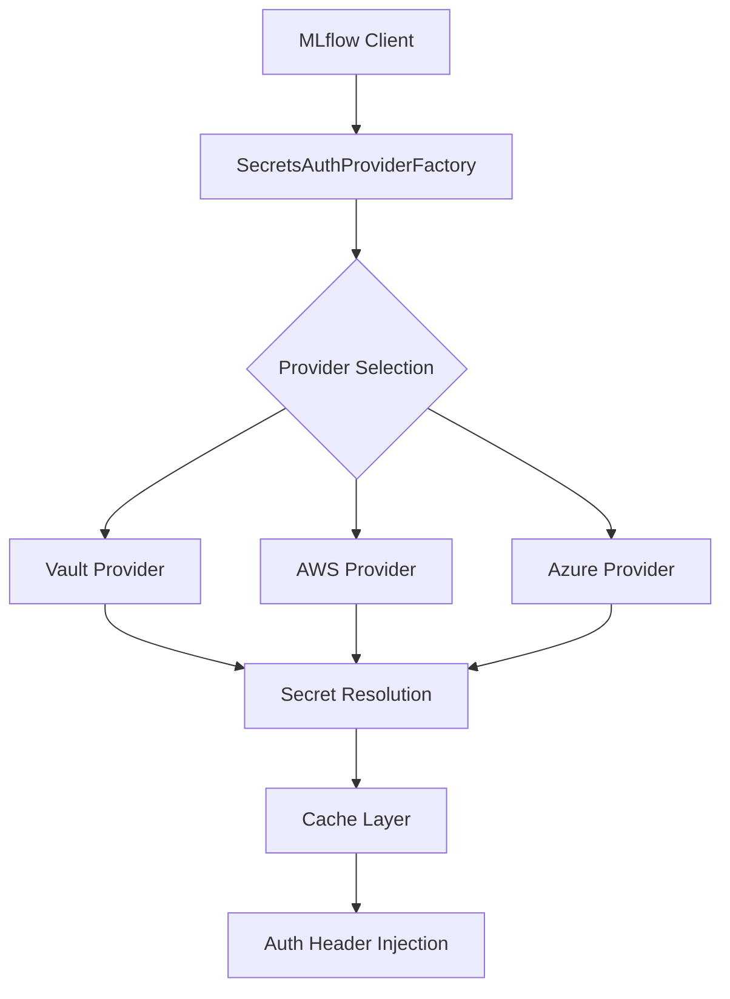

# MLflow Secrets Auth

A plugin for MLflow that automatically injects authentication headers from secret managers into tracking requests — securely, transparently, and with zero secret leaks.

## Overview

MLflow Secrets Auth enables seamless authentication for MLflow tracking requests by retrieving credentials from enterprise secret management systems. The plugin supports multiple providers and maintains security best practices through host allowlisting, credential redaction, and secure caching.

### Key Features

- **Multi-Provider Support**: HashiCorp Vault, AWS Secrets Manager, and Azure Key Vault
- **Transparent Integration**: Zero code changes required in existing MLflow workflows
- **Security First**: Host allowlisting, credential redaction, and secure in-memory caching
- **Production Ready**: Configurable TTL, retry logic with jitter, and comprehensive error handling
- **Flexible Authentication**: Bearer tokens, Basic auth, and custom header support

### Supported Providers

| Provider | Status | Auth Methods | Secret Types |
|----------|--------|--------------|--------------|
| HashiCorp Vault | ✅ Stable | Token, AppRole | KV v1/v2 |
| AWS Secrets Manager | ✅ Stable | IAM, AssumeRole | SecretString, SecretBinary |
| Azure Key Vault | ✅ Stable | DefaultAzureCredential | Secrets |

### Architecture

The plugin implements MLflow's `RequestAuthProvider` interface using a factory pattern that automatically selects and configures the first available provider. Secret resolution follows a secure flow with caching, retries, and comprehensive error handling.



## Quick Start

### Installation

```bash
# Basic installation
pip install mlflow-secrets-auth

# With specific provider support
pip install mlflow-secrets-auth[vault]
pip install mlflow-secrets-auth[aws]
pip install mlflow-secrets-auth[azure]

# All providers
pip install mlflow-secrets-auth[vault,aws,azure]
```

### Minimal Configuration

Configure your preferred provider and enable the plugin:

```bash
# Vault example
export VAULT_ADDR="https://vault.company.com"
export VAULT_TOKEN="hvs.XXXXXXXXXXXXXXXX"
export MLFLOW_VAULT_SECRET_PATH="secret/mlflow/auth"
export MLFLOW_SECRETS_AUTH_ENABLE="vault"

# Activate the plugin in MLflow (required)
export MLFLOW_TRACKING_AUTH="mlflow_secrets_auth"

# Your existing MLflow code works unchanged
mlflow.start_run()
mlflow.log_metric("accuracy", 0.95)
```

### Basic Usage

```python
import mlflow

# No code changes required - authentication happens automatically
mlflow.set_tracking_uri("https://mlflow.company.com")
mlflow.start_run()
mlflow.log_param("model_type", "random_forest")
mlflow.log_metric("accuracy", 0.95)
mlflow.end_run()
```

## Demo

For a complete working example, try our demo that shows the plugin working end-to-end:

```bash
git clone https://github.com/hugodscarvalho/mlflow-secrets-auth
cd mlflow-secrets-auth/examples/vault-nginx-mlflow
make demo
```

The demo includes:

- HashiCorp Vault storing MLflow credentials
- Nginx reverse proxy enforcing authentication
- MLflow tracking server with experiments
- Python client using the plugin transparently

## Next Steps

- [Installation Guide](installation.md) - Complete installation instructions with provider-specific dependencies
- [Configuration Reference](configuration.md) - Environment variables and configuration options
- [Getting Started](getting-started.md) - Step-by-step setup guide with examples
- [Provider Documentation](providers/) - Provider-specific configuration and examples
- [CLI Tools](cli.md) - Command-line utilities for diagnostics and troubleshooting

## Support

- **Documentation**: Comprehensive guides and examples
- **CLI Diagnostics**: Built-in `doctor` command for troubleshooting
- **Security**: Host allowlisting and credential redaction
- **Monitoring**: Detailed logging and error reporting

For issues and feature requests, please visit the [GitHub repository](https://github.com/hugodscarvalho/mlflow-secrets-auth).
